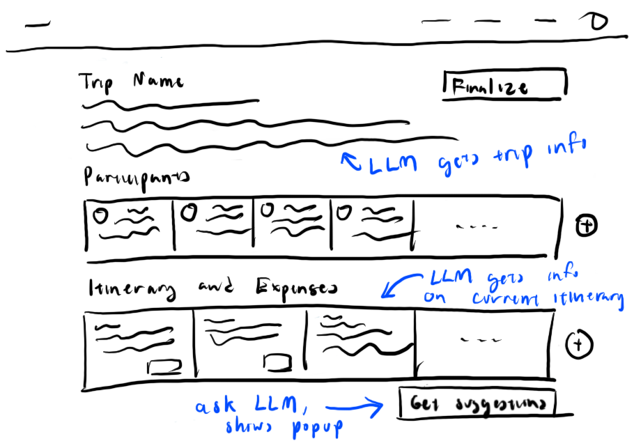
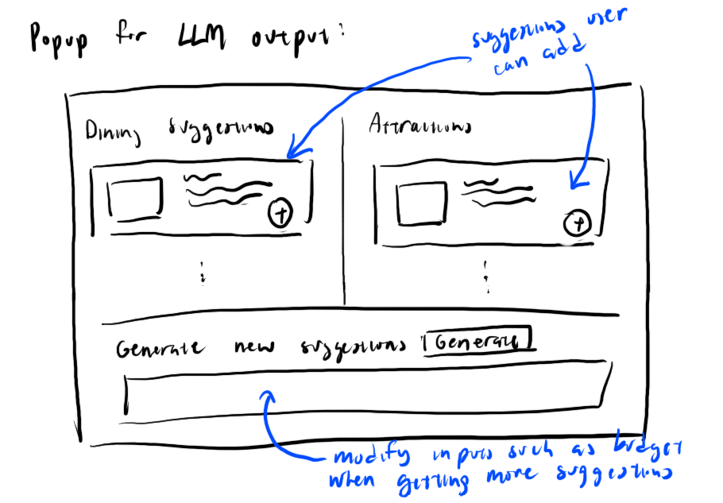

# Assignment 3

## Concept

### Orginal

**concept** PlanItinerary [Trip]

**purpose** keep track of possible activities to be done during a trip or outting

**principle** an itinerary is created for a trip. Users can add and remove events from the intinerary. Added events await approval before being offically added. Reject events to remove them from the plan.

**state**

a set of Itineraries with

-   a trip Trip
-   a set of Events
-   a finalized Flag

a set of Events with

-   a name String
-   a cost Number
-   a time Date
-   a pending Flag
-   an approved Flag

**action**

create(trip:Trip): Itinerary

-   **requires** itinerary for trip to not already exist
-   **effects** creates new itinerary for trip

addEvent(name: String, cost: Number, itinerary: Itinerary, time: Date)

-   **effects** add new pending event to the itinerary

updateEvent(event: Event, name: String, cost: Number, time: Date)

-   **requires** event to exist
-   **effects** updates event

setEventApproval(event: Event, approved: Flag)

-   **requires** event to exist
-   **effects** sets approval flag for itinerary and update pending to false

finalizeItinerary(itinerary: Itinerary, finalized: Flag)

-   **requires** itinerary to exist
-   **effects** sets itinerary finalized to given flag

### AI-Augmented

We can augment AI into the itinerary planner so that we can provide users with a feature to suggest activities to add to the itinerary to users. This would allow users to plan out their trip more effortlessly:

**concept** PlanItinerary [Trip]

**purpose** keep track of possible activities to be done during a trip or outting

**principle** an itinerary is created for a trip. Users can add and remove events from the intinerary. Added events await approval before being offically added. Reject events to remove them from the plan.

**state**

a set of Itineraries with

-   a trip Trip
-   a set of Events
-   a finalized Flag
-   a budget Number

a set of Events with

-   a name String
-   a cost Number
-   a location String
-   a time Date
-   a pending Flag
-   an approved Flag

**action**

create(trip:Trip): Itinerary

-   **requires** itinerary for trip to not already exist
-   **effects** creates new itinerary for trip

addEvent(name: String, cost: Number, itinerary: Itinerary, time: Date)

-   **effects** add new pending event to the itinerary

updateEvent(event: Event, name: String, cost: Number, time: Date)

-   **requires** event to exist
-   **effects** updates event

setEventApproval(event: Event, approved: Flag)

-   **requires** event to exist
-   **effects** sets approval flag for itinerary and update pending to false

finalizeItinerary(itinerary: Itinerary, finalized: Flag)

-   **requires** itinerary to exist
-   **effects** sets itinerary finalized to given flag

requestSuggestionFromLLM()

-   **effects** returns suggestions of places to visit or dine at based on the trip's information, budget, and what's already on the itinerary

## User Interaction

After finalizing the dates and destination for their family trip to Rome, a user opens GroupGetaway and visits the trip’s planning page. They add a few must-see spots to the itinerary, but realize that it is still too empty for a 2-week vacation. The user remembers that the app offers an activity suggestion feature. They click “Get Suggestions” below the itinerary, and after a short moment, a list of recommended attractions and restaurants appears, tailored to their trip details and group budget. The user looks over the list and find some of the suggestions viable. They click the plus button next to each of these activities to add it to the itinerary for family approval. With a fuller itinerary, the user feels that they can still cram in some more activities, but with a tighter budger, they adjust the budget filter. They click the “Generate More” button and receive a fresh list of less costly suggestions. The user repeats this process until they have filled out their itinerary.

Trip planning page:

## Test Cases and Prompts

1. **Ambiguous destination for a trip** - A user is planning to go on a trip to Rome during their spring break. To plan their itinerary, the user opens our app and quickly fills out the trip's information. In their hurry, they accidentally put "Spring Break" for their destination instead of "Rome". They fill out some activities they would like to do at their time there on the trip planning page, but wanted some suggestions, so they click the "Get Suggestions" button, but the LLM was not given a proper destination!

When given an ambiguous destination, the LLM picked a some random trip destination and created suggestions for it. To fix this, I changed the prompt to tell it to check if there are existing events in itinerary and use those events to derive a location. It worked (sometimes). The LLM was able to pick out the correct location at times. However, when the itinerary was empty and the LLM had nothing to reference, it began to hallucinate locations. For example, they decided "Spring Break, USA" was a location and began to hallucinate attractions there. I changed the prompt to tell it that if it really couldn't find a location, it should return an error message. This doesn't work however and remains an issue.

2. **Extremely Low Budget** - A user has planned out most of their trip's itinerary and have used up most of their budget. They only have 50 dollars left, but still some considerable amount of time to fill up. The activities on the itinerary are ones they really looked forward to, so they were unwilling to switch them out for cheaper alternatives. Instead, they ask our app for some suggestions，hoping it would know some low budget places.

The LLM is provided with the remaining budget for the trip and it was pretty good at providing activities that are within the budget constraints. For example, they provided mostly free options, plus a few low budget options. However, some of the activities did not seem to be valid or good activities to do on a vacation. For example, the LLM suggested to go to a restaurant and order a single pastry. I changed the prompt and told the LLM to give meanful activities. Afterwards, the LLM suggested to "Enjoy a crepe from a street vendor", which was too vague to be put on a trip itinerary. I changed the prompt to tell the LLM to be more detailed and include names of places instead of giving something generic. It seemed to work, since the LLM began to give better, more specific suggestions after that.

3. **Extremely Packed Schedule** - A user and her friends are super excited about their trip to NYC and had a long list of everything they wanted to do. After filling out their itinerary on the app, they want to add more, since they want to make the most out of their trip. They press the "Get Suggestion" button without realizing that they have already almost overbooked their time.

The LLM provides activities without much regard to how much time the user has for the vacation. I added a prompt to tell it to pay attention to how much time the activities in the itinerary currently take up. If there isn't much time left (if the activities already in the itinerary take up most of the day), then suggest activities that don't take long. The LLM suggested more shorter duration activites compared to before, but there were still some longer activities in there, so this issue is not completely solved.

## Validators

We don't want the LLM to be suggesting locations that the user had already added to the itinerary, since that would not be helpful. So a validator we would want is to check if the location suggested already exists in the plan. Also it would be important to double check if the activities the LLM suggested fits in the user's budget. Another important thing to check for is if the suggestions from the LLM is actually located in the trip destination.
